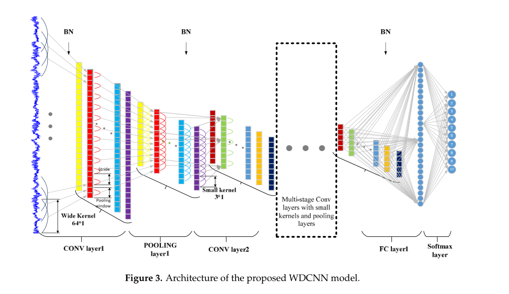
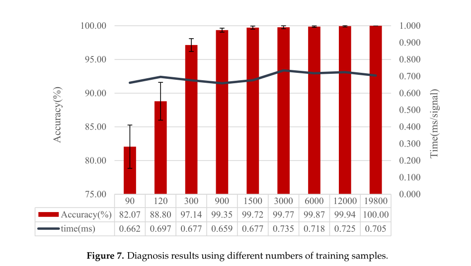
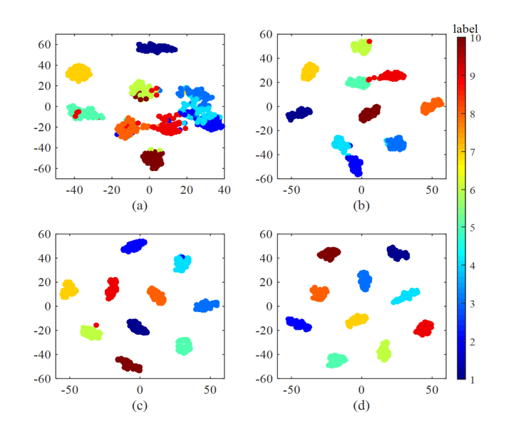
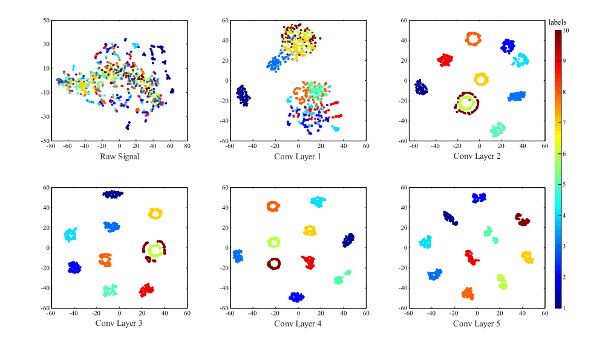
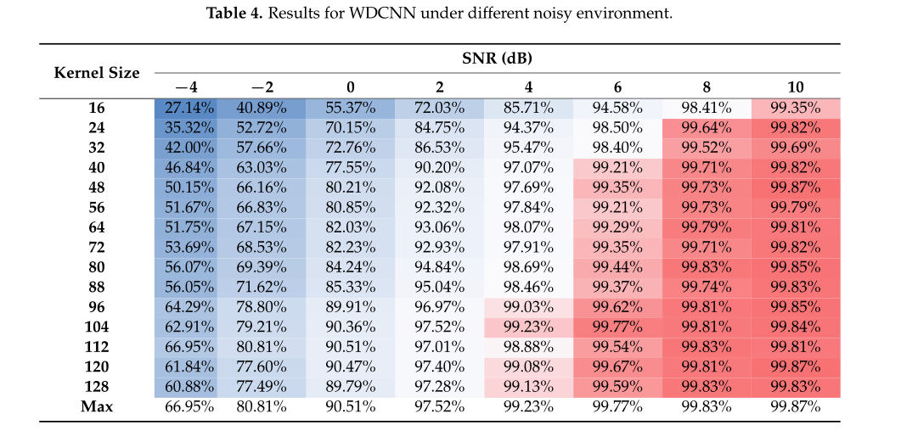

# Deep-Convolutional-Neural-Networks-with-Wide-First-layer-Kernels
这是一个首层卷积为宽卷积的深度神经网络Deep Convolutional Neural Networks with Wide First-layer Kernels (WDCNN)的实现，该模型具有优越的抗噪能力，可用于轴承的智能故障诊断。
# 模型结构

# 不同数据量对模型性能的影响

# t-SNE可视化

# 抗噪性分析

# 卷积可视化

